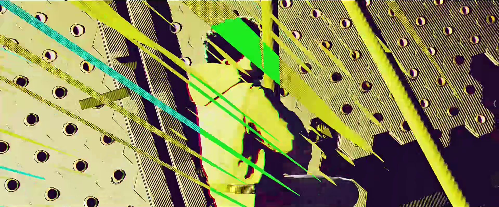
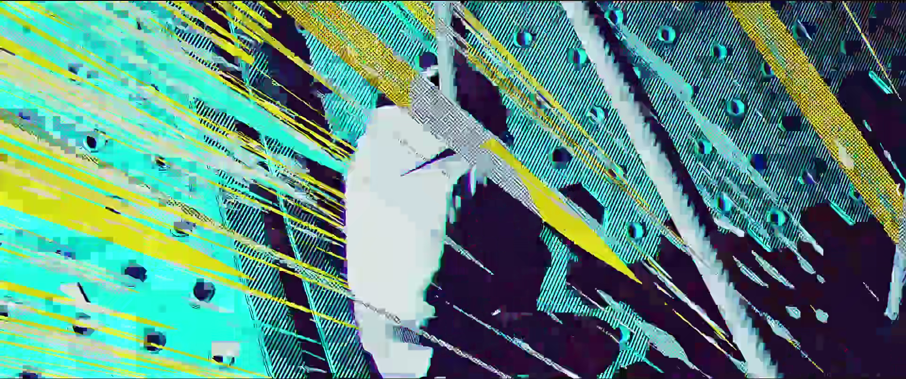

# Tyan0046_9103_tut09

##  Imaging Technique Inspiration
***Let me show you the screenshots first***



*From the Movie: Spider-Man: Across the Spider-Verse*
####  Colors can affect people's emotions. At the same time, people's emotions can be expressed through colors. Rapidly changing colors can show that people's emotions fluctuate greatly. For example, these images from a movie: the shock of the main character and his emotional shock at the time are shown by the high brightness of the colors and the rapid change of colors. Similarly, the shape and number of lines can be used to show emotions. Sharp straight lines are used in the movie and gradually become denser, giving the viewer a sense of urgency.

##  Coding Technique Exploration

####  The painting we chose to work on was the scream. Behind the figures in this picture there are very thick curvy clouds, and I thought that I could use the amount of curves and color changes of these clouds to show the change of mood of the person who is going to shout.

>Code from happy coding website

```
size(500, 500);

strokeWeight(4);
background(32);

float distance = 0;

float r = random(256);
float g = random(256);
float b = random(256);
float cChange = 2;
float distanceChange = .001;

for (float angle = 0; angle < 360*100; angle += .1) {

  float x = width/2 + cos(radians(angle))*distance;
  float y = height/2 + sin(radians(angle))*distance;

  r += random(-cChange, cChange);
  r = constrain(r, 0, 256);

  g += random(-cChange, cChange);
  g = constrain(g, 0, 256);

  b += random(-cChange, cChange);
  b = constrain(b, 0, 256);

  stroke(r, g, b);

  point(x, y);

  distance += distanceChange;
}
```
####  This code generates spiral circles with random colors. I can learn this code and use it to generate arcs instead of full circles.####
